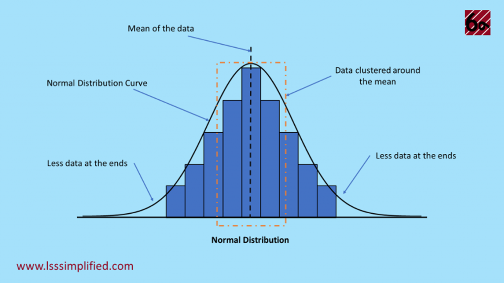

#  Simulation_sample_Normal_distribution

## What is a normal distribution in statistics?
Normal distribution, also known as the Gaussian distribution, is a probability distribution that is symmetric about the mean, showing that data near the mean are more 
frequent in occurrence than data far from the mean. In graph form, normal distribution will appear as a bell curve.

### Task
A-Study of the confidence interval of the mean

1. Simulate  M = 50,000 $ samples of size  n = 20  following a normal distribution of
 mean mu = -1.2  and variance = 2 .
2. On each sample, perform a  90%  confidence interval estimate of the mean  mu .
